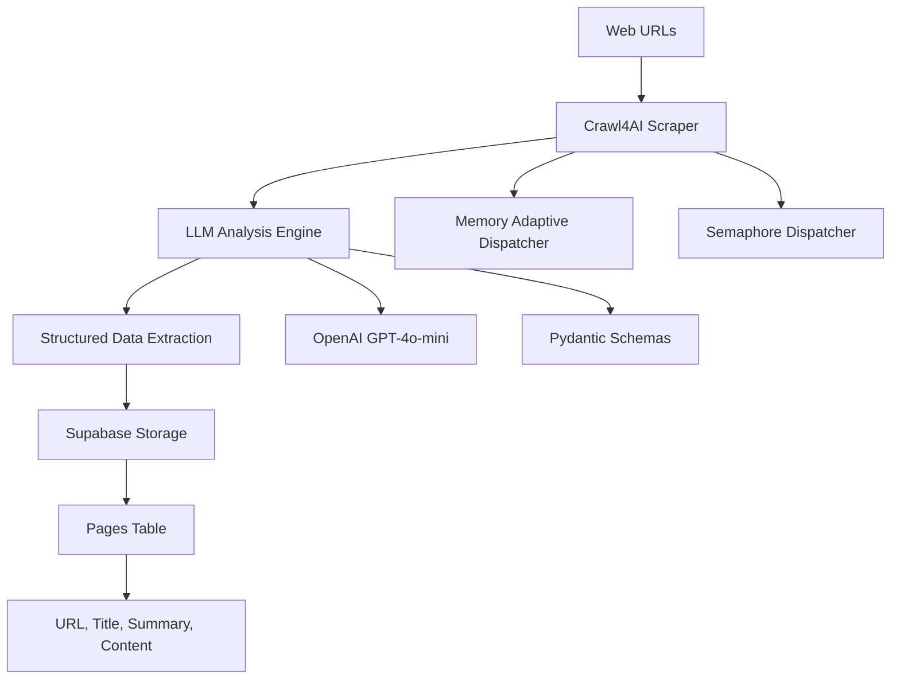

# 🕸️ Supa-Crawl: AI-Powered Web Intelligence Pipeline

**A sophisticated end-to-end solution combining Crawl4AI, OpenAI LLMs, and Supabase for intelligent web data extraction and storage.**


## 🎯 Overview

Supa-Crawl transforms web scraping from basic HTML extraction into intelligent content analysis. Instead of just getting raw text, you get:

- **AI-Generated Titles**: Meaningful, context-aware page titles
- **Smart Summaries**: Concise, paragraph-length content summaries  
- **Structured Storage**: Clean, queryable data in Supabase
- **Real-time Processing**: Async operations with comprehensive monitoring

## ✨ Key Features

### 🧠 LLM-Powered Content Analysis
- **OpenAI GPT-4o-mini** integration for intelligent text processing
- **Structured extraction** using Pydantic schemas
- **Context-aware summaries** that capture page essence
- **Title generation** from content analysis

### 🚀 Advanced Crawling Strategies  
- **Memory Adaptive Dispatcher**: Optimizes resource usage based on content size
- **Semaphore Dispatcher**: Controls concurrent operations for rate limiting
- **Stealth Configuration**: Avoids bot detection with realistic browser behavior
- **Multi-URL Processing**: Batch operations with error resilience

### 💾 Intelligent Data Storage
- **Supabase Integration**: Real-time PostgreSQL database
- **Structured Schema**: Separate columns for URL, title, summary, and raw content
- **Upsert Operations**: Handles duplicate URLs gracefully
- **Migration Support**: Database schema evolution

## 🏗️ Architecture



## 🚀 Quick Start

### Prerequisites
```bash
# Required Python version
Python 3.12+

# Environment variables needed
OPENAI_API_KEY=your_openai_key
SUPABASE_URL=your_supabase_url  
SUPABASE_KEY=your_supabase_key
```

### Installation
```bash
# Clone repository
git clone https://github.com/Gaya56/supa-crawl.git
cd supa-crawl

# Install dependencies
pip install -r requirements.txt

# Install browser dependencies
playwright install
sudo playwright install-deps  # Linux/macOS
```

### Basic Usage
```python
import asyncio
from src.crawlers.async_crawler import AdvancedWebCrawler

async def main():
    crawler = AdvancedWebCrawler()
    
    # Simple crawling with LLM analysis
    urls = ["https://example.com", "https://docs.crawl4ai.com"]
    results = await crawler.crawl_with_llm_analysis(urls)
    
    # Full pipeline with storage
    success = await crawler.crawl_and_store_in_supabase(urls)
    print(f"Storage successful: {success}")

asyncio.run(main())
```

### Run Complete Demo
```bash
python main.py
```

## 📊 Database Schema

```sql
CREATE TABLE pages (
    id BIGINT PRIMARY KEY GENERATED ALWAYS AS IDENTITY,
    url TEXT NOT NULL,
    title TEXT,           -- AI-generated title
    summary TEXT,         -- AI-generated summary  
    content TEXT          -- Raw markdown content
);
```

## 🛠️ Core Components

### AdvancedWebCrawler
**Primary crawling engine with multiple dispatch strategies**

```python
# Memory Adaptive - Optimizes based on content size
results = await crawler.crawl_with_memory_adaptive_dispatcher(urls)

# Semaphore - Controls concurrency
results = await crawler.crawl_with_semaphore_dispatcher(urls)

# LLM Analysis - Intelligent content extraction  
results = await crawler.crawl_with_llm_analysis(urls)

# Full Pipeline - Crawl + Analyze + Store
success = await crawler.crawl_and_store_in_supabase(urls)
```

### LLM Integration
**Powered by OpenAI GPT-4o-mini with structured extraction**

```python
from src.models.schemas import PageSummary

# Pydantic schema guides LLM extraction
class PageSummary(BaseModel):
    title: str = Field(description="The main title of the web page")
    summary: str = Field(description="A short paragraph summary of the page content")
```

### Supabase Handler
**Real-time database operations with error handling**

```python
from src.storage.supabase_handler import SupabaseHandler

storage = SupabaseHandler()

# Store with structured data
response = storage.store_page_summary(
    url="https://example.com",
    title="Example Domain", 
    summary="A demonstration page for documentation examples.",
    raw_markdown="# Example Domain..."
)
```

## 📈 Performance Features

- **Async Operations**: Non-blocking I/O for high throughput
- **Error Resilience**: Continues processing despite individual failures
- **Resource Optimization**: Memory adaptive strategies
- **Rate Limiting**: Configurable concurrency controls
- **Monitoring**: Comprehensive logging and progress tracking

## 🔧 Configuration

### Environment Setup
Create `.env` file:
```env
# OpenAI Configuration
OPENAI_API_KEY=sk-your-key-here

# Supabase Configuration  
SUPABASE_URL=https://your-project.supabase.co
SUPABASE_KEY=your-anon-key

# Optional: Crawl4AI Settings
CRAWL4AI_VERBOSE=false
CRAWL4AI_CACHE_MODE=bypass
```

### Advanced Configuration
```python
from crawl4ai.config import BrowserConfig, CrawlerRunConfig

# Custom browser configuration
browser_config = BrowserConfig(
    headless=True,
    verbose=False,
    extra_args=["--no-sandbox", "--disable-dev-shm-usage"]
)

# Custom crawler settings
run_config = CrawlerRunConfig(
    cache_mode=CacheMode.BYPASS,
    word_count_threshold=10,
    extraction_strategy=LLMExtractionStrategy(...)
)
```

## 📚 Documentation

- [API Reference](docs/api/reference.md) - Complete method documentation
- [Architecture Overview](docs/architecture/overview.md) - System design details
- [Quick Start Guide](docs/guides/quick-start.md) - Step-by-step setup
- [Advanced Usage](docs/guides/advanced-usage.md) - Optimization techniques
- [Troubleshooting](docs/guides/troubleshooting.md) - Common issues

## 🧪 Testing

```bash
# Run all tests
python -m pytest tests/ -v

# Test specific components
python -m pytest tests/crawl4ai/ -v          # Crawl4AI integration
python -m pytest tests/supabase/ -v         # Database operations  
python -m pytest tests/integration/ -v      # End-to-end pipeline
```

## 🤝 Contributing

1. Fork the repository
2. Create feature branch (`git checkout -b feature/amazing-feature`)
3. Commit changes (`git commit -m 'Add amazing feature'`)
4. Push to branch (`git push origin feature/amazing-feature`)
5. Open Pull Request

## 📝 License

This project is licensed under the MIT License - see the [LICENSE](LICENSE) file for details.

## 🙏 Acknowledgments

- **Crawl4AI Team** - Excellent web crawling framework
- **OpenAI** - Powerful LLM capabilities
- **Supabase** - Real-time database infrastructure

## 🔗 Links

- [Crawl4AI Documentation](https://docs.crawl4ai.com/)
- [OpenAI API Documentation](https://platform.openai.com/docs)
- [Supabase Documentation](https://supabase.com/docs)

---

**Built with ❤️ for intelligent web data extraction**