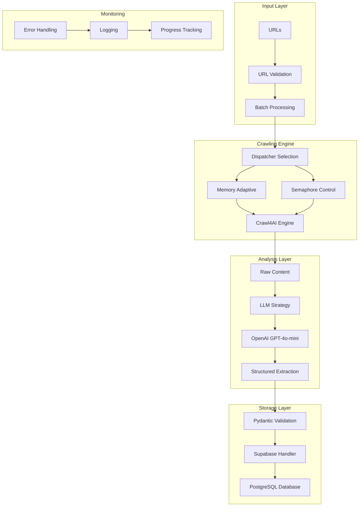
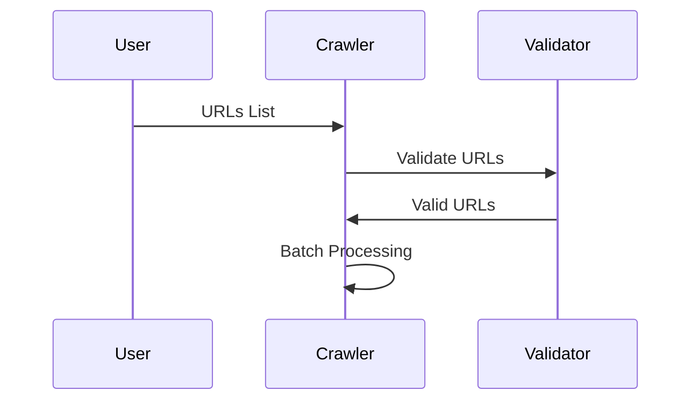
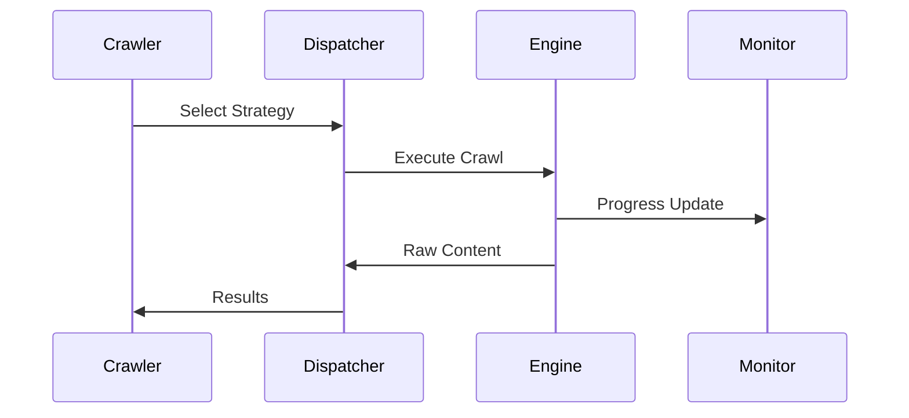
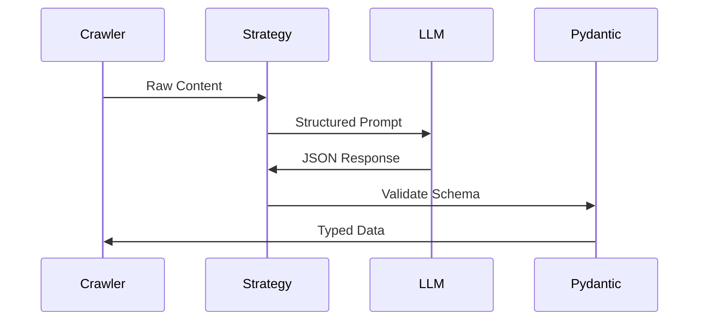
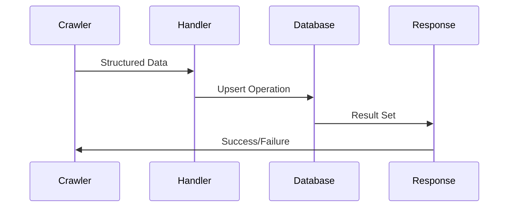
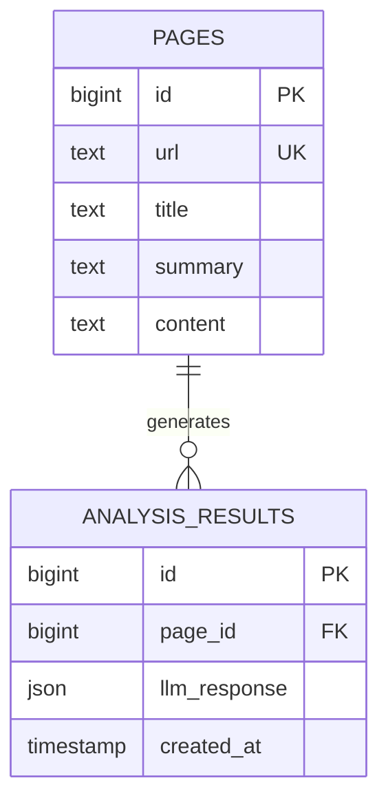
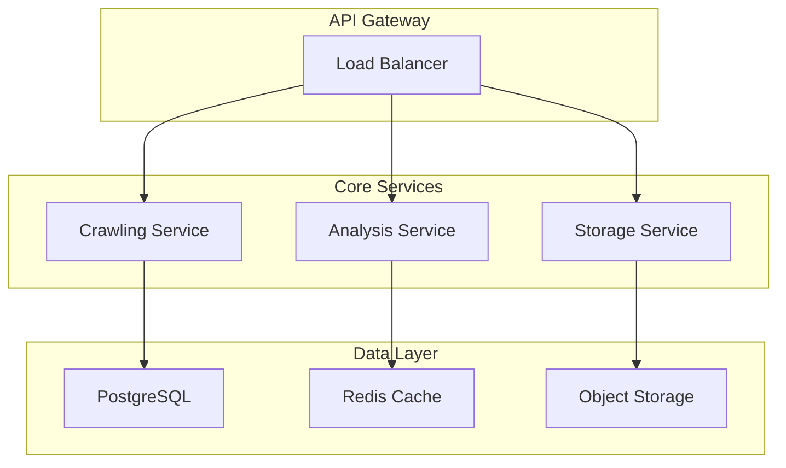

# Architecture Overview

Comprehensive overview of the Supa-Crawl system architecture, design patterns, and data flow.

## System Architecture

### High-Level Overview



## Core Components

### 1. Crawling Engine (`src/crawlers/async_crawler.py`)

**Purpose**: Multi-strategy web crawling with async operations

**Key Features**:
- **Memory Adaptive Dispatcher**: Dynamically adjusts resource allocation
- **Semaphore Dispatcher**: Controls concurrent operations
- **Error Resilience**: Continues processing despite individual failures
- **Progress Monitoring**: Real-time status updates

**Design Patterns**:
```python
class AdvancedWebCrawler:
    def __init__(self):
        self.client = AsyncWebCrawler()  # Crawl4AI client
        self.storage_handler = SupabaseHandler()  # Database integration
        
    async def crawl_with_memory_adaptive_dispatcher(self, urls):
        # Strategy Pattern: Choose dispatcher based on requirements
        pass
        
    async def crawl_with_llm_analysis(self, urls):
        # Template Method: Standardized LLM processing pipeline
        pass
```

### 2. LLM Analysis Engine

**Purpose**: Intelligent content extraction using Large Language Models

**Architecture**:
```python
# Strategy Pattern Implementation
LLMExtractionStrategy(
    provider="openai/gpt-4o-mini",           # Provider abstraction
    schema=PageSummary.model_json_schema(),   # Contract definition
    instruction="Extract title and summary"   # Behavior specification
)
```

**Data Flow**:
1. Raw HTML/Markdown → LLM Strategy
2. LLM Strategy → OpenAI API
3. OpenAI Response → Pydantic Validation
4. Validated Data → Storage Layer

### 3. Data Models (`src/models/schemas.py`)

**Purpose**: Type-safe data structures with validation

```python
from pydantic import BaseModel, Field

class PageSummary(BaseModel):
    title: str = Field(description="The main title of the web page")
    summary: str = Field(description="A short paragraph summary of the page content")
    
    class Config:
        # Validation rules
        str_strip_whitespace = True
        min_anystr_length = 1
```

**Benefits**:
- **Type Safety**: Compile-time error detection
- **Validation**: Automatic data quality checks
- **Documentation**: Self-documenting schemas
- **LLM Guidance**: Field descriptions guide AI extraction

### 4. Storage Layer (`src/storage/supabase_handler.py`)

**Purpose**: Real-time database operations with error handling

**Design Patterns**:
- **Repository Pattern**: Abstracts database operations
- **Connection Pool**: Efficient resource management
- **Upsert Strategy**: Handles duplicate data gracefully

```python
class SupabaseHandler:
    def __init__(self):
        self.client = create_client(url, key)  # Connection management
        
    def store_page_summary(self, url, title, summary, raw_markdown):
        # Repository pattern: Abstract database operations
        return self.client.table('pages').upsert({
            'url': url,
            'title': title,
            'summary': summary,
            'content': raw_markdown
        }).execute()
```

## Data Flow Architecture

### 1. Input Processing



### 2. Crawling Pipeline



### 3. LLM Analysis Pipeline



### 4. Storage Pipeline



## Database Schema Design

### Entity-Relationship Model

```sql
-- Pages table: Core entity for storing web content
CREATE TABLE pages (
    id BIGINT PRIMARY KEY GENERATED ALWAYS AS IDENTITY,
    url TEXT NOT NULL,              -- Source identifier
    title TEXT,                     -- AI-extracted title
    summary TEXT,                   -- AI-generated summary
    content TEXT                    -- Raw markdown content
);

-- Indexes for performance
CREATE INDEX idx_pages_url ON pages(url);
CREATE INDEX idx_pages_title ON pages(title);
```

### Data Relationships



## Concurrency & Performance

### Async Architecture

```python
# Non-blocking I/O operations
async def crawl_with_llm_analysis(self, urls):
    tasks = []
    for url in urls:
        task = asyncio.create_task(self._process_single_url(url))
        tasks.append(task)
    
    # Concurrent execution with error isolation
    results = await asyncio.gather(*tasks, return_exceptions=True)
    return [r for r in results if not isinstance(r, Exception)]
```

### Resource Management

```python
# Memory adaptive strategy
class MemoryAdaptiveDispatcher:
    def __init__(self):
        self.max_memory_threshold = 0.8  # 80% of available memory
        
    async def dispatch(self, urls):
        memory_usage = psutil.virtual_memory().percent
        if memory_usage > self.max_memory_threshold:
            # Reduce batch size
            batch_size = max(1, len(urls) // 2)
        else:
            batch_size = len(urls)
```

## Error Handling Strategy

### Hierarchical Error Management

```python
# Application-level errors
class CrawlError(Exception):
    """Base exception for crawling operations"""
    
class LLMAnalysisError(CrawlError):
    """Specific to LLM processing failures"""
    
class StorageError(CrawlError):
    """Database operation failures"""

# Error recovery patterns
async def resilient_crawl(url):
    try:
        return await self._crawl_url(url)
    except CrawlError as e:
        logger.warning(f"Crawl failed for {url}: {e}")
        return None  # Continue with other URLs
    except Exception as e:
        logger.error(f"Unexpected error for {url}: {e}")
        raise  # Critical system error
```

### Circuit Breaker Pattern

```python
class CircuitBreaker:
    def __init__(self, failure_threshold=5, timeout=60):
        self.failure_count = 0
        self.failure_threshold = failure_threshold
        self.timeout = timeout
        self.last_failure_time = None
        self.state = "CLOSED"  # CLOSED, OPEN, HALF_OPEN
```

## Security Considerations

### API Key Management

```python
# Environment-based configuration
class EnvironmentConfig:
    def __init__(self):
        self.openai_api_key = os.getenv('OPENAI_API_KEY')
        self.supabase_url = os.getenv('SUPABASE_URL')
        self.supabase_key = os.getenv('SUPABASE_KEY')
        
    def validate(self):
        required = ['openai_api_key', 'supabase_url', 'supabase_key']
        missing = [k for k in required if not getattr(self, k)]
        if missing:
            raise ConfigurationError(f"Missing: {missing}")
```

### Data Validation

```python
# Input sanitization
def sanitize_url(url: str) -> str:
    parsed = urlparse(url)
    if parsed.scheme not in ['http', 'https']:
        raise ValueError("Only HTTP/HTTPS URLs supported")
    return url

# Output validation
class PageSummary(BaseModel):
    title: str = Field(max_length=200, description="Page title")
    summary: str = Field(max_length=1000, description="Content summary")
```

## Monitoring & Observability

### Logging Strategy

```python
import logging

# Structured logging
logger = logging.getLogger(__name__)
logger.setLevel(logging.INFO)

# Context-rich log messages
logger.info("Crawl started", extra={
    "urls_count": len(urls),
    "strategy": "memory_adaptive",
    "timestamp": datetime.utcnow()
})
```

### Performance Metrics

```python
# Timing decorators
@measure_execution_time
async def crawl_with_llm_analysis(self, urls):
    # Method implementation
    pass

# Memory usage tracking
@monitor_memory_usage
async def process_large_batch(self, urls):
    # Resource-intensive operations
    pass
```

## Scalability Patterns

### Horizontal Scaling

```python
# Distributed processing capability
class DistributedCrawler:
    def __init__(self, worker_nodes):
        self.workers = worker_nodes
        
    async def distribute_work(self, urls):
        chunk_size = len(urls) // len(self.workers)
        chunks = [urls[i:i+chunk_size] for i in range(0, len(urls), chunk_size)]
        
        tasks = [
            worker.crawl_batch(chunk) 
            for worker, chunk in zip(self.workers, chunks)
        ]
        
        return await asyncio.gather(*tasks)
```

### Caching Strategy

```python
# Redis integration for caching
class CacheManager:
    def __init__(self):
        self.redis_client = redis.Redis()
        
    async def get_cached_result(self, url_hash):
        return await self.redis_client.get(f"crawl:{url_hash}")
        
    async def cache_result(self, url_hash, result, ttl=3600):
        await self.redis_client.setex(f"crawl:{url_hash}", ttl, result)
```

## Future Architecture Considerations

### Microservices Migration



### Event-Driven Architecture

```python
# Message queue integration
class EventBus:
    async def publish(self, event_type, data):
        await self.queue.put({
            "type": event_type,
            "data": data,
            "timestamp": datetime.utcnow()
        })
        
    async def subscribe(self, event_type, handler):
        # Event subscription logic
        pass
```

This architecture provides a robust foundation for intelligent web data extraction while maintaining flexibility for future enhancements and scaling requirements.