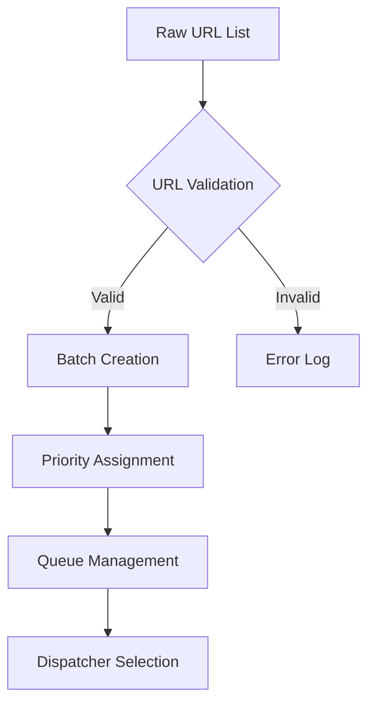
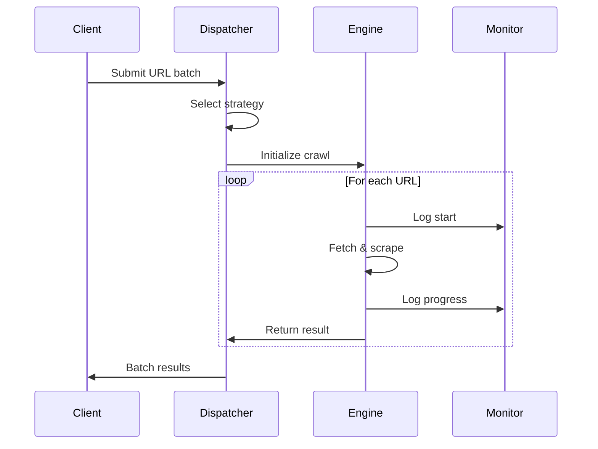
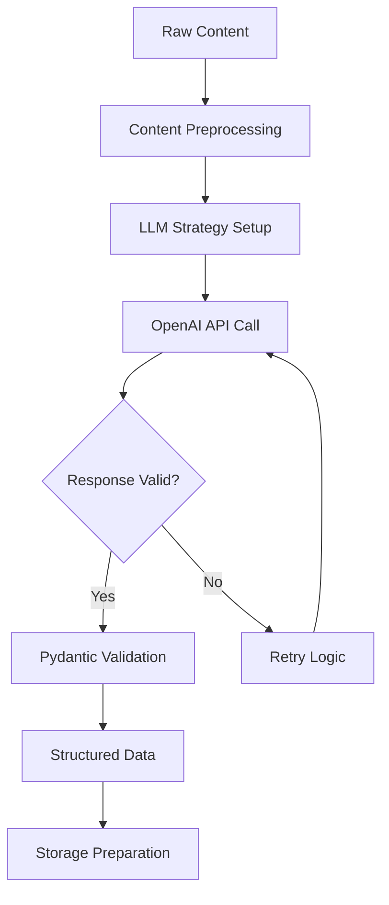
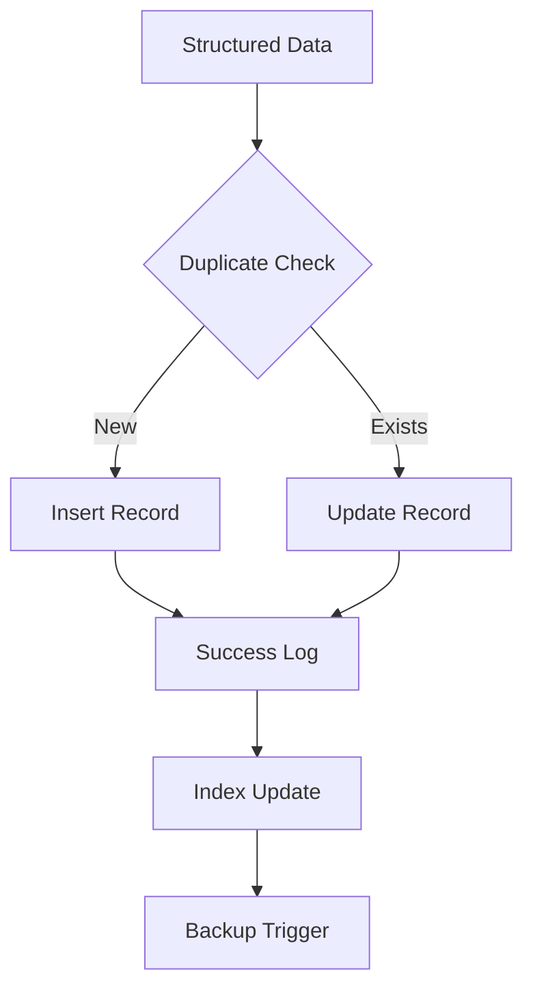
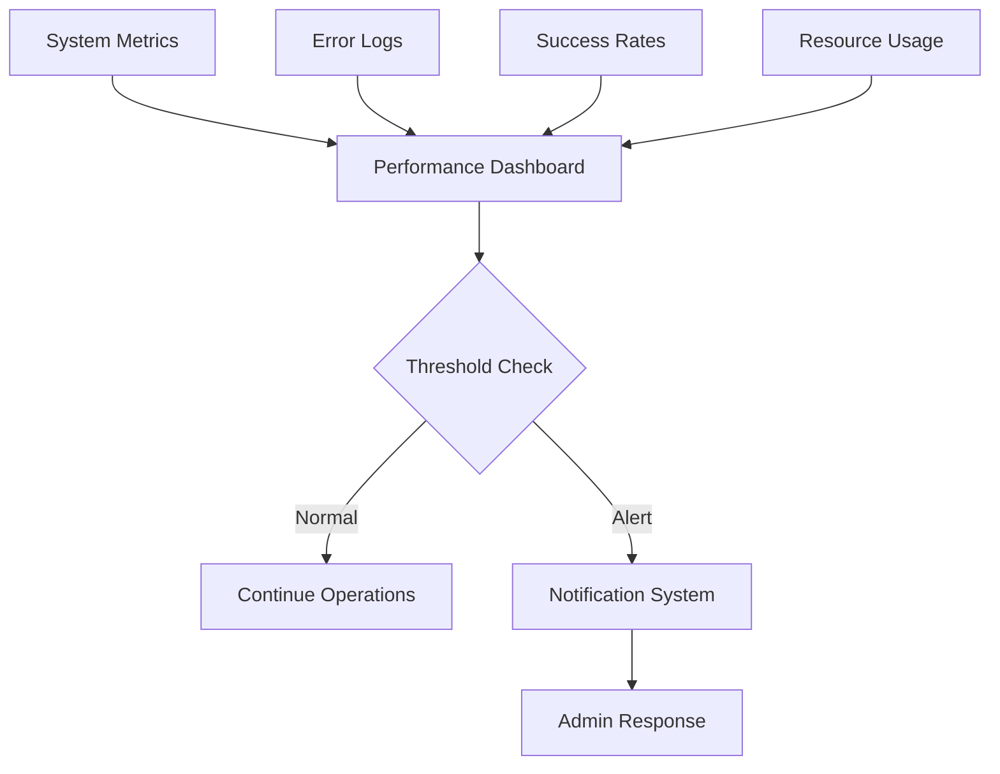
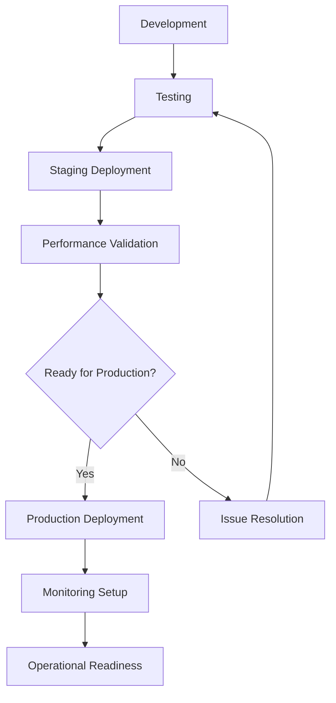
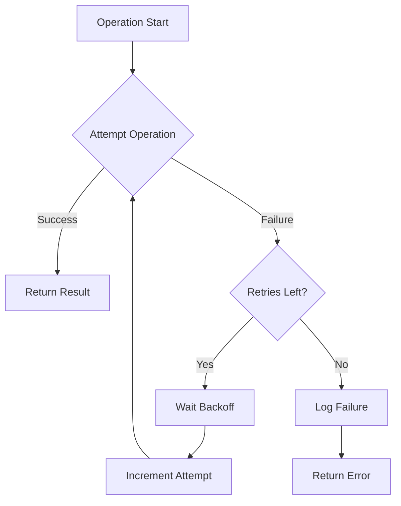
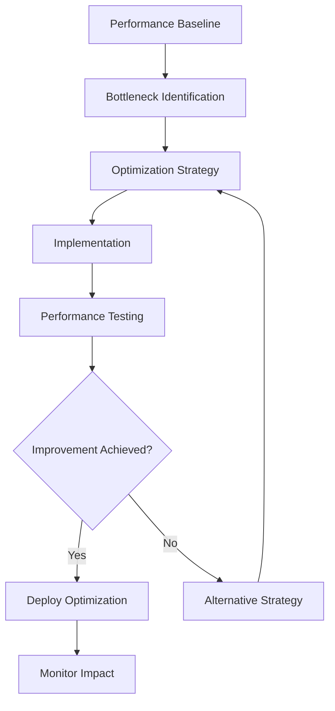

# Workflow Documentation

Detailed workflow processes for the Supa-Crawl LLM pipeline, from initial setup to production deployment.

## Overview

The Supa-Crawl workflow encompasses four main phases:
1. **Setup & Configuration**
2. **Data Collection & Processing** 
3. **Analysis & Storage**
4. **Monitoring & Maintenance**

## Workflow Phases

### Phase 1: Setup & Configuration

#### 1.1 Environment Preparation

```bash
# Step 1: Clone repository
git clone https://github.com/Gaya56/supa-crawl.git
cd supa-crawl

# Step 2: Create virtual environment
python -m venv .venv
source .venv/bin/activate  # Linux/macOS
# or .venv\Scripts\activate  # Windows

# Step 3: Install dependencies
pip install -r requirements.txt

# Step 4: Install browser dependencies
playwright install
sudo playwright install-deps  # Linux/macOS
```

#### 1.2 Configuration Setup

```bash
# Create environment file
cp .env.example .env

# Configure required variables
# OPENAI_API_KEY=sk-your-openai-key
# SUPABASE_URL=https://your-project.supabase.co
# SUPABASE_KEY=your-anon-key
```

#### 1.3 Database Initialization

```sql
-- Execute in Supabase SQL editor
CREATE TABLE pages (
    id BIGINT PRIMARY KEY GENERATED ALWAYS AS IDENTITY,
    url TEXT NOT NULL,
    title TEXT,
    summary TEXT,
    content TEXT
);

-- Create indexes for performance
CREATE INDEX idx_pages_url ON pages(url);
CREATE INDEX idx_pages_title ON pages(title);
```

### Phase 2: Data Collection & Processing

#### 2.1 URL Preparation Workflow



**Implementation:**
```python
# URL validation and batching
def prepare_urls(raw_urls: List[str]) -> List[List[str]]:
    # Step 1: Validate URLs
    valid_urls = [url for url in raw_urls if validate_url(url)]
    
    # Step 2: Create batches
    batch_size = 10  # Configurable
    batches = [valid_urls[i:i+batch_size] 
               for i in range(0, len(valid_urls), batch_size)]
    
    return batches

def validate_url(url: str) -> bool:
    try:
        result = urlparse(url)
        return all([result.scheme, result.netloc])
    except:
        return False
```

#### 2.2 Crawling Workflow



**Dispatcher Selection Logic:**
```python
async def select_dispatcher(urls: List[str], system_resources: Dict) -> str:
    url_count = len(urls)
    memory_usage = system_resources['memory_percent']
    
    if url_count > 50 or memory_usage > 70:
        return "semaphore"  # Controlled concurrency
    else:
        return "memory_adaptive"  # Optimized resource usage
```

### Phase 3: Analysis & Storage

#### 3.1 LLM Analysis Workflow



**LLM Processing Implementation:**
```python
async def process_with_llm(content: str) -> Dict[str, str]:
    # Step 1: Prepare extraction strategy
    strategy = LLMExtractionStrategy(
        provider="openai/gpt-4o-mini",
        api_token=os.getenv('OPENAI_API_KEY'),
        schema=PageSummary.model_json_schema(),
        instruction="""
        Extract the main title and create a concise summary.
        Focus on the core purpose and value of the content.
        Keep the summary to 1-2 sentences.
        """
    )
    
    # Step 2: Execute extraction
    result = await strategy.extract(content)
    
    # Step 3: Validate and return
    if result and isinstance(result, list) and len(result) > 0:
        return result[0]
    else:
        return {"title": "No title extracted", "summary": "No summary extracted"}
```

#### 3.2 Storage Workflow



**Storage Implementation:**
```python
def store_page_summary(self, url: str, title: str, summary: str, raw_markdown: str = None):
    try:
        # Upsert operation to handle duplicates
        data = {
            'url': url,
            'title': title,
            'summary': summary,
            'content': raw_markdown
        }
        
        response = self.client.table('pages').upsert(data).execute()
        
        if response.data:
            logger.info(f"✓ Stored page summary: {url}")
            return response
        else:
            logger.warning(f"⚠ No data returned for: {url}")
            return None
            
    except Exception as e:
        logger.error(f"✗ Failed to store {url}: {str(e)}")
        return None
```

### Phase 4: Monitoring & Maintenance

#### 4.1 Real-time Monitoring Workflow



**Monitoring Implementation:**
```python
class MonitoringSystem:
    def __init__(self):
        self.metrics = {
            'crawls_successful': 0,
            'crawls_failed': 0,
            'llm_calls': 0,
            'storage_operations': 0
        }
    
    def log_crawl_success(self, url: str, duration: float):
        self.metrics['crawls_successful'] += 1
        logger.info(f"✓ Crawl success: {url} ({duration:.2f}s)")
    
    def log_crawl_failure(self, url: str, error: str):
        self.metrics['crawls_failed'] += 1
        logger.error(f"✗ Crawl failed: {url} - {error}")
    
    def get_success_rate(self) -> float:
        total = self.metrics['crawls_successful'] + self.metrics['crawls_failed']
        return self.metrics['crawls_successful'] / total if total > 0 else 0
```

## Complete End-to-End Workflow

### Production Deployment Process



### Daily Operations Workflow

```python
async def daily_crawl_operation():
    """Complete daily crawling workflow"""
    
    # Phase 1: Preparation
    logger.info("🚀 Starting daily crawl operation")
    urls = load_target_urls()
    
    # Phase 2: System Check
    if not check_system_health():
        logger.error("❌ System health check failed")
        return False
    
    # Phase 3: Processing
    crawler = AdvancedWebCrawler()
    
    try:
        # Execute with monitoring
        results = await crawler.crawl_with_llm_analysis(urls)
        
        # Phase 4: Storage
        storage_success = await crawler.store_results(results)
        
        # Phase 5: Reporting
        generate_daily_report(results)
        
        logger.info("✅ Daily operation completed successfully")
        return True
        
    except Exception as e:
        logger.error(f"❌ Daily operation failed: {str(e)}")
        send_alert_notification(str(e))
        return False
```

## Error Handling Workflows

### Retry Logic Workflow



**Retry Implementation:**
```python
async def retry_with_backoff(operation, max_retries=3, base_delay=1):
    for attempt in range(max_retries):
        try:
            return await operation()
        except Exception as e:
            if attempt == max_retries - 1:
                raise e
            
            delay = base_delay * (2 ** attempt)  # Exponential backoff
            logger.warning(f"Attempt {attempt + 1} failed, retrying in {delay}s: {e}")
            await asyncio.sleep(delay)
```

## Quality Assurance Workflow

### Data Quality Checks

```python
def validate_extraction_quality(result: Dict[str, Any]) -> bool:
    """Validate LLM extraction results"""
    
    checks = [
        # Title quality
        len(result.get('title', '')) > 5,
        'title' not in result.get('title', '').lower(),
        
        # Summary quality  
        len(result.get('summary', '')) > 20,
        'summary' not in result.get('summary', '').lower(),
        
        # Content coherence
        result.get('title') != result.get('summary')
    ]
    
    return all(checks)
```

### Performance Optimization Workflow



## Backup & Recovery Workflow

### Data Backup Process

```python
async def backup_workflow():
    """Automated backup process"""
    
    # 1. Create backup snapshot
    timestamp = datetime.now().strftime("%Y%m%d_%H%M%S")
    backup_name = f"supa_crawl_backup_{timestamp}"
    
    # 2. Export data
    pages_data = await export_pages_table()
    
    # 3. Store backup
    backup_location = f"backups/{backup_name}.json"
    with open(backup_location, 'w') as f:
        json.dump(pages_data, f, indent=2)
    
    # 4. Verify backup integrity
    if verify_backup(backup_location):
        logger.info(f"✅ Backup completed: {backup_name}")
    else:
        logger.error(f"❌ Backup verification failed: {backup_name}")
```

## Maintenance Workflows

### Weekly Maintenance Tasks

```python
async def weekly_maintenance():
    """Weekly system maintenance"""
    
    tasks = [
        cleanup_old_logs(),
        optimize_database_indexes(),
        update_system_dependencies(),
        generate_performance_report(),
        backup_configuration_files()
    ]
    
    results = await asyncio.gather(*tasks, return_exceptions=True)
    
    # Report maintenance results
    for i, result in enumerate(results):
        task_name = tasks[i].__name__
        if isinstance(result, Exception):
            logger.error(f"❌ Maintenance task failed: {task_name} - {result}")
        else:
            logger.info(f"✅ Maintenance task completed: {task_name}")
```

This comprehensive workflow documentation ensures smooth operations and maintainable processes for the Supa-Crawl system.